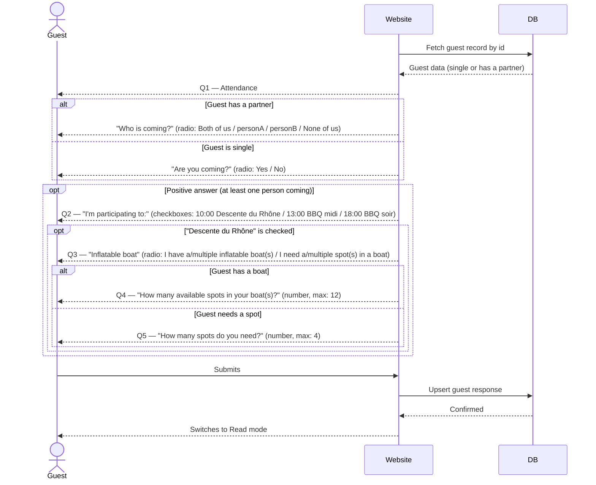

# Form Flow

```mermaid
sequenceDiagram
    actor Guest
    participant Website
    participant DB

    Website->>DB: Fetch guest record by id
    DB-->>Website: Guest data (single or has a partner)

    Website-->>Guest: Q1 — Attendance

    alt Guest has a partner
        Website-->>Guest: "Who is coming?" (radio: Both of us / personA / personB / None of us)
    else Guest is single
        Website-->>Guest: "Are you coming?" (radio: Yes / No)
    end

    opt Positive answer (at least one person coming)
        Website-->>Guest: Q2 — "I'm participating to:" (checkboxes: 10:00 Descente du Rhône / 13:00 BBQ midi / 18:00 BBQ soir)

        opt "Descente du Rhône" is checked
            Website-->>Guest: Q3 — "Inflatable boat" (radio: I have a/multiple inflatable boat(s) / I need a/multiple spot(s) in a boat)

            alt Guest has a boat
                Website-->>Guest: Q4 — "How many available spots in your boat(s)?" (number, max: 12)
            else Guest needs a spot
                Website-->>Guest: Q5 — "How many spots do you need?" (number, max: 4)
            end
        end
    end

    Guest->>Website: Submits
    Website->>DB: Upsert guest response
    DB-->>Website: Confirmed
    Website-->>Guest: Switches to Read mode
```
