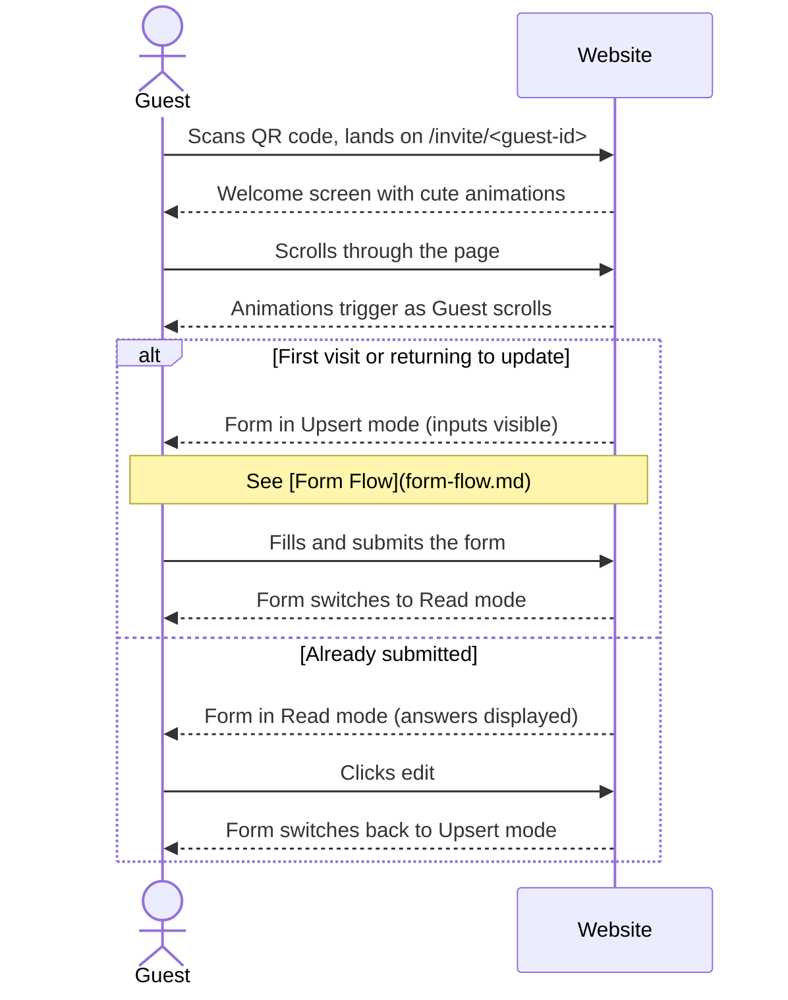

# User Story: Guest Visits Website from QR Code

```mermaid
sequenceDiagram
    actor Guest
    participant Website

    Guest->>Website: Scans QR code, lands on /invite/<guest-id>
    Website-->>Guest: Welcome screen with cute animations
    Guest->>Website: Scrolls through the page
    Website-->>Guest: Animations trigger as Guest scrolls

    alt First visit or returning to update
        Website-->>Guest: Form in Upsert mode (inputs visible)
        Note over Guest,Website: See [Form Flow](form-flow.md)
        Guest->>Website: Fills and submits the form
        Website-->>Guest: Form switches to Read mode
    else Already submitted
        Website-->>Guest: Form in Read mode (answers displayed)
        Guest->>Website: Clicks edit
        Website-->>Guest: Form switches back to Upsert mode
    end
```
